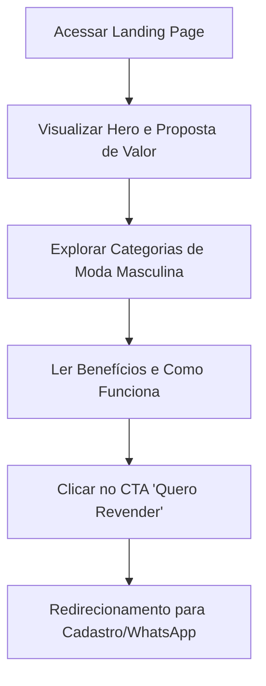

## 1. Visão Geral do Produto
O "Dropshipping Milionário" é uma landing page de vendas focada em atrair revendedores para um fornecedor único de roupas e acessórios masculinos no modelo dropshipping.
- O objetivo principal é converter visitantes em revendedores, destacando a facilidade de vender moda masculina premium sem a necessidade de estoque próprio, com logística integrada e catálogo atualizado.

## 2. Funcionalidades Principais

### 2.1 Módulos de Funcionalidade
1. **Página Inicial (Landing Page)**: Hero section de alta conversão, apresentação de categorias, benefícios do dropshipping, como funciona e chamadas para ação (CTAs).

### 2.2 Detalhes da Página
| Nome da Página | Nome do Módulo | Descrição da Funcionalidade |
|----------------|----------------|-----------------------------|
| Landing Page | Hero Section | Título de impacto, subtítulo explicativo, botão de CTA principal e imagem/vídeo de fundo relacionada a moda masculina de luxo/sucesso. |
| Landing Page | Categorias | Grid ou carrossel exibindo os nichos de produtos (Camisetas, Camisas, Calças, Acessórios, etc.). |
| Landing Page | Benefícios | Seções detalhando as vantagens: Venda sem estoque, Pedidos automatizados, Catálogo atualizado e Logística integrada. |
| Landing Page | Como Funciona | Passo a passo visual de como é o processo de revenda com o fornecedor. |
| Landing Page | CTA Final | Seção de conversão no rodapé reforçando o convite para se tornar revendedor. |

## 3. Processo Principal
O usuário entra na página, entende a proposta de valor, navega pelas categorias e benefícios, e clica no botão para se cadastrar como revendedor.

## 4. Design de Interface do Usuário
### 4.1 Estilo de Design
- **Cores Primárias e Secundárias**: Preto (luxo/masculino), Dourado/Amarelo (remetendo a "Milionário" e sucesso) e Branco/Cinza claro para contraste e legibilidade.
- **Estilo de Botões**: Botões grandes, com cantos levemente arredondados, cor de destaque (Dourado/Amarelo) e efeitos de hover sutis.
- **Fontes e Tamanhos**: Fonte sem serifa moderna e elegante (ex: Montserrat, Inter ou Playfair Display para títulos).
- **Estilo de Layout**: Layout limpo, seções bem divididas com bastante espaço em branco, uso de cards para benefícios e categorias.
- **Imagens**: Fotos de alta qualidade de moda masculina, estilo de vida sofisticado e empreendedorismo.

### 4.2 Visão Geral do Design da Página
| Nome da Página | Nome do Módulo | Elementos de UI |
|----------------|----------------|-----------------|
| Landing Page | Hero | Fundo escuro com imagem de alta qualidade, texto em branco/dourado, CTA contrastante. |
| Landing Page | Benefícios | Cards minimalistas com ícones dourados, título e texto explicativo. |
| Landing Page | Categorias | Grid de imagens com overlay escuro e nome da categoria em destaque. |

### 4.3 Responsividade
Design focado primeiro em desktop (desktop-first), mas totalmente adaptável para dispositivos móveis, com menus colapsáveis e grids que se transformam em colunas únicas em telas menores.