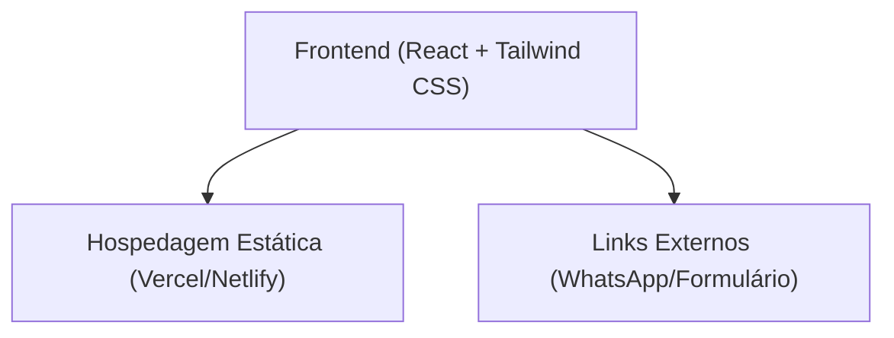

## 1. Design da Arquitetura

## 2. Descrição da Tecnologia
- **Frontend**: React@18 + tailwindcss@3 + vite
- **Ícones**: Lucide React
- **Animações**: Framer Motion
- **Ferramenta de Inicialização**: vite-init

## 3. Definições de Rotas
| Rota | Propósito |
|------|-----------|
| / | Página inicial (Landing Page única) |